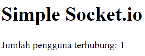

## Socket.IO TCP Contoh



Ini adalah contoh implementasi sederhana dari Socket.IO TCP menggunakan Node.js.

### Instalasi

1. Pastikan Anda memiliki Node.js terinstal di sistem Anda.
2. Salin file `index.js` ke direktori proyek Anda.
3. Buka terminal dan arahkan ke direktori proyek.
4. Jalankan perintah berikut untuk menginstal dependensi:

   ```
   npm install express socket.io
   ```

### Menjalankan Aplikasi

1. Buka terminal dan arahkan ke direktori proyek.
2. Jalankan perintah berikut untuk menjalankan server:

   ```
   node index.js
   ```

3. Server akan berjalan di `http://localhost:3000`.
4. Untuk menguji aplikasi, buka beberapa tab atau jendela browser dan akses `http://localhost:3000`.
5. Anda akan melihat jumlah pengguna terhubung saat ini.

### Penjelasan Kode

Berikut adalah penjelasan singkat tentang kode dalam file `index.js`:

1. Impor library yang diperlukan:

   ```javascript
   const express = require('express');
   const app = express();
   const http = require('http').Server(app);
   const io = require('socket.io')(http);
   ```

2. Inisialisasi variabel `connectedUsers` untuk melacak jumlah pengguna terhubung:

   ```javascript
   let connectedUsers = 0;
   ```

3. Menggunakan event listener `connection` untuk menangani koneksi baru:

   ```javascript
   io.on('connection', (socket) => {
     connectedUsers++;
     io.emit('userCount', connectedUsers);

     socket.on('disconnect', () => {
       connectedUsers--;
       io.emit('userCount', connectedUsers);
     });
   });
   ```

   Saat ada koneksi baru, `connectedUsers` akan ditambahkan satu dan event `userCount` akan dikirim ke semua pengguna yang terhubung. Ketika koneksi terputus, `connectedUsers` akan dikurangi satu dan event `userCount` akan kembali dikirim.

4. Menjalankan server pada port 3000:

   ```javascript
   http.listen(3000, () => {
     console.log('Server listening on port 3000');
   });
   ```

   Server akan berjalan di `http://localhost:3000`.

### Lisensi

Tidak ada informasi lisensi yang tersedia.
